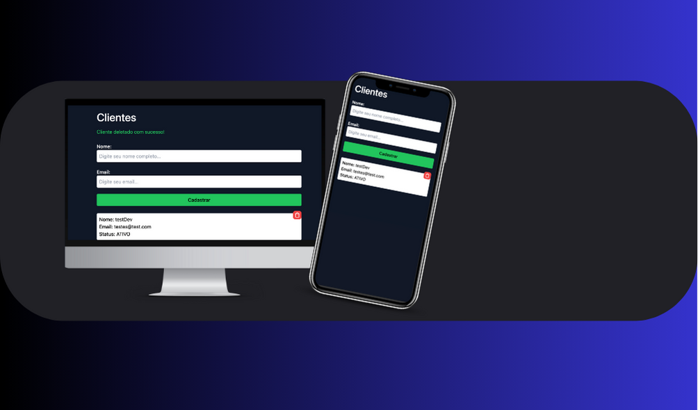

# 🚀 Project BE (Back-End)

Welcome to the documentation of your Back-End project! This README will guide you through the structure, functionalities, and how to get started with the project.

## 📋 Table of Contents

- [Introduction](#-introduction)
- [Prerequisites](#-prerequisites)
- [Installation](#-installation)
- [Project Structure](#-project-structure)
- [Usage](#-usage)
- [Endpoints](#-endpoints)
- [Contributing](#-contributing)
- [License](#-license)

## 📝 Introduction

This project is a Back-End application built with Fastify and Prisma, designed to manage customers. It provides basic CRUD (Create, Read, Update, Delete) operations for managing customer data.

## 🛠️ Prerequisites

Before you begin, ensure you have the following installed on your machine:

- Node.js
- npm (Node Package Manager)
- MongoDB

## 🚀 Installation

Follow these steps to get your project up and running:

1. **Clone** this repository to your local machine.
2. **Navigate** to the project directory in your terminal.
3. **Install dependencies** by running:

npm install

markdown
Copy code

4. **Set up your environment variables**. Create a `.env` file in the root directory and define your `DATABASE_URL` for MongoDB.

5. **Run the application**:

npm start

markdown
Copy code

## 📁 Project Structure

The project structure is organized as follows:

- `controllers/`: Contains controller classes responsible for handling HTTP requests and responses.
- `models/`: Defines data models using Prisma schema.
- `services/`: Implements business logic for various operations.
- `routes.ts`: Defines the API routes using Fastify.
- `app.ts`: Main entry point of the application where Fastify instance is created and configured.
- `prisma.ts`: Configuration file for Prisma client.

## 🚀 Usage

Once the application is running, you can interact with it using HTTP requests. Refer to the [Endpoints](#-endpoints) section for available endpoints and their descriptions.

## 🛣️ Endpoints

- `POST /customer`: Create a new customer.
- `GET /customers`: Get a list of all customers.
- `DELETE /customer`: Delete a customer by ID.

## 🤝 Contributing

Contributions are welcome! If you'd like to contribute to this project, feel free to submit a pull request with your changes.

## 📄 License

This project is licensed under the MIT License - see the [LICENSE](LICENSE) file